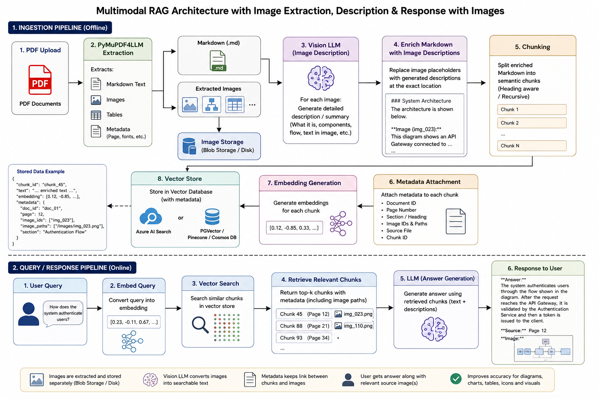

# DocVision RAG

> A Multimodal Document Intelligence & Retrieval Platform that enhances traditional RAG by incorporating visual understanding from diagrams, tables, charts, and images.

## Overview

DocVision RAG extracts structured content from PDF documents using **PyMuPDF4LLM**, enriches extracted images with AI-generated descriptions using a multimodal vision model, and indexes the enriched document into a vector database for highly accurate semantic retrieval.

Unlike traditional RAG, the system understands both textual and visual information, enabling users to ask questions about architecture diagrams, flowcharts, screenshots, tables, and other embedded visuals.

---

## Architecture

---

## Features

- 📄 PDF to Markdown conversion
- 🖼️ Automatic image extraction
- 👁️ Vision LLM image understanding
- 📝 Image description injection into Markdown
- ✂️ Intelligent Markdown chunking
- 🔍 Semantic search using vector embeddings
- 📊 Metadata-aware retrieval
- 🖼️ Return relevant source images with answers
- ⚡ FastAPI backend
- ☁️ Azure AI Search / Vector Database support

---

## Technology Stack

- PyMuPDF4LLM
- FastAPI
- Azure AI Search
- Azure OpenAI / OpenAI Vision Models
- Vector Embeddings
- Python

---

## Repository Structure
- to be decided

